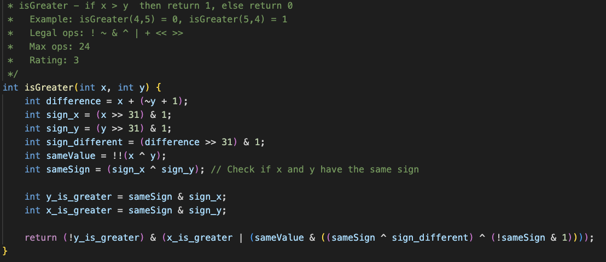
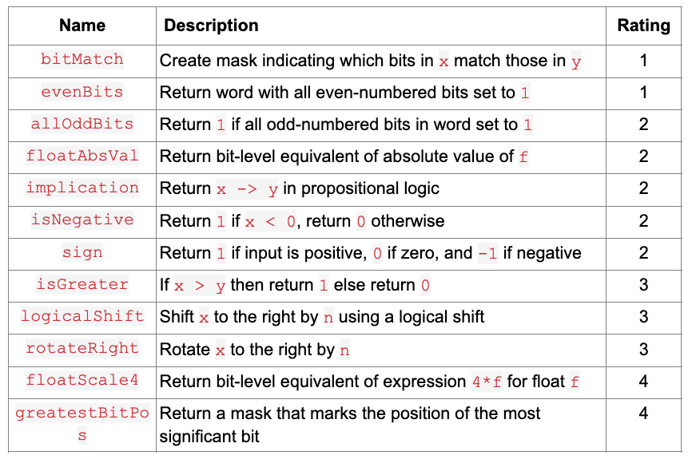

# Bitwise Puzzle
Converted functions with restrictions on operators like +, -, *, or /. This challenged me to convert binary numbers to decimal numbers using different strategies. Including bitwise shifting, &&’ ing offset bits with numbers, and ~ bits.



### What I Learned
- 



For example:


This made it easier for project 3 when we converted those functions into assembly code and we had to shift numbers in specific registers to complete tasks.

## <a href="https://www.youtube.com/watch?v=UNz9k9E9IWM"> Demo Video on YouTube </a>

## Setup

If you want to play around with Bitwise Puzzle, feel free to clone my repo. To start, please enter the following commands on your terminal:

```
git clone https://github.com/CamNagle24/Bitwise-Puzzle
make
```

At this point, you are free to type in whatever sequence of commands you like.

```
./btest
```

./btest will give you all the tests that the code tests and passes.
