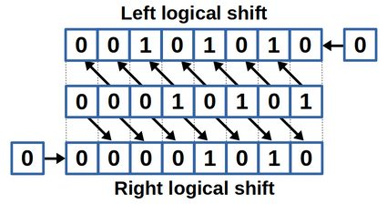

# Bitwise Puzzle
Converted functions with restrictions on operators like +, -, *, or /. This challenged me to convert binary numbers to decimal numbers using different strategies. Including bitwise shifting, &&’ ing offset bits with numbers, and ~ bits.


### What I Learned
- Master bitwise operations (~, &, |, ^, <<, >>) to manipulate data at the bit level.
- Develop efficient solutions within strict constraints (limited operations and no conditionals or loops).
- Learn to handle floating-point numbers through bitwise manipulation without using floating-point types or operations.
- Strengthen debugging and testing skills using automated tools like btest and dlc for verification and optimization.


For example:



This made it easier for project 3 when we converted those functions into assembly code and we had to shift numbers in specific registers to complete tasks.

## <a href="https://youtu.be/hAHwhz35-9w"> Demo Video on YouTube </a>

## Setup

If you want to play around with Bitwise Puzzle, feel free to clone my repo. To start, please enter the following commands on your terminal:

```
git clone https://github.com/CamNagle24/Bitwise-Puzzle
make
```

At this point, you are free to type in whatever sequence of commands you like.

```
./btest
```

./btest will give you all the tests that the code tests and passes.
